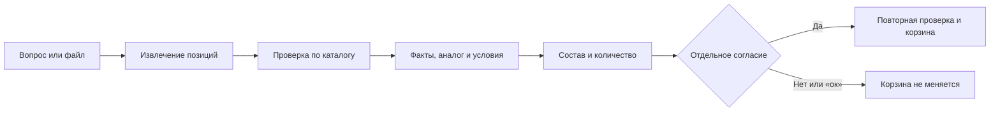

# От спецификации до корзины: пошаговый пример

Основание: [Word ТЗ](<../docs/source of truth/assets/HackAlem AI_ ИИ-ассистент для чата на сайте ekt.kz.docx>), UC-01…05. Здесь сценарий работы с приложением; исторические наблюдения имеют отдельную дату.

## Одна история для демонстрации

«Закупщику нужно собрать электротехнические позиции из спецификации. Сегодня типовые вопросы о наличии, документах и замене требуют общения с менеджером. Наш помощник в одном чате читает запрос или документ, проверяет каталог и показывает варианты. Покупатель подтверждает точный состав — только тогда меняется корзина».

Польза для покупателя — меньше ручного переноса позиций и переключений до проверенного выбора. Для менеджера — возможность уделять время сложным сделкам. Сокращение времени, обращений и оттока пока **гипотезы без измеренного размера эффекта**.

## Подготовить до показа

1. Запустить `make dev` по [README](../README.md). Проверить доступ OpenAI/ekt.kz в локальном окружении; показывать только браузер, не `.env`.
2. Открыть новую сессию. В чате должен быть режим «ИИ подключён · каталог ekt.kz», корзина — пустой. Проверить остатки контрольных товаров перед выступлением: они изменяются.
3. Подготовить **один** существующий [specification.xlsx](inputs/specification.xlsx). Для демонстрации визуального ввода выбрать вместо него [PDF со сканом](inputs/specification-scan.pdf) или [JPEG](inputs/specification.jpeg), а не загружать все версии одной спецификации в общий заказ.
4. Знать ожидаемые строки: `027005` / `200300274_` — 2 шт.; `027028` / `200300275_` — 1 шт. Не заучивать цену и остаток: их получает приложение.
5. Отдельно пройти текстовый сценарий нулевого остатка `ярп4520`; запасной проверенный запрос — `310100080_`. Если остаток больше нуля, честно сказать об изменении данных и использовать другую действительно отсутствующую позицию.
6. Пройти весь путь в новой сессии. Следующий порядок — короткий пример знакомства с приложением; время зависит от каталога и обработки файла.

## Показ на 4 минуты

| Время | Действие и реплика | Что должно быть видно | UC / результат |
| --- | --- | --- | --- |
| 0:00–0:25 | Назвать покупателя, его задачу и ожидание менеджера. Открыть лендинг: «От вопроса до корзины». | Конкретный пользователь и конечный результат; три входа: артикул, файл, замена. | Ценность |
| 0:25–1:15 | «Прикрепить спецификацию» → XLSX → `Покажи наличие и характеристики всех позиций из файла.` | Блок «Проверка спецификации»: две готовые строки с количествами 2 и 1; артикулы и остатки из каталога; раскрыть одну карточку. Документы показаны при наличии, отсутствие сертификата обозначено. Корзина ещё пуста. | UC-01 / качество, ценность |
| 1:15–1:45 | `Есть ли ярп4520 в наличии?` | Нулевой остаток исходного товара и минимум один доступный аналог с объяснением. Показать отличия, не заявлять полную совместимость без данных. | UC-02 / качество, инновационность |
| 1:45–2:05 | `Как оплатить, получить доставку и какая минимальная партия?` | Разделы оплаты/доставки/минимума, источник и неоднозначности. | UC-03 / качество |
| 2:05–2:55 | Вернуться к «Проверке спецификации», оставить две строки и нажать «Проверить выбранное». Сначала `ок`, затем действующую кнопку «Да, добавить». | Предложение 2 + 1; после «ок» корзина прежняя; после явного согласия — 3 единицы. При изменении наличия показать отказ и согласовать новый состав. | UC-04 / качество, отличие подхода |
| 2:55–3:20 | Открыть ссылку `/cart`, обновить страницу и снова открыть корзину. | Две строки, количества 2 и 1, текущая сумма, состояние сохранено в сессии. Заказ/резерв на ekt.kz не создан. | UC-05 / результат |
| 3:20–4:00 | Объяснить отличие, границы и следующий пилот. | Один сервис сейчас; постоянная корзина и интеграция магазина дальше. Экономический эффект требует замеров. | Инновационность, масштабирование, презентация |

Прикрепление файла с просьбой добавить позиции также сначала открывает проверку строк; готовую партию нужно выбрать. Старый `file_to_cart` в [наблюдениях](observed-session.json) относится к прежнему интерфейсу с автоматической подготовкой предложения, не к текущему шагу выбора.

Чтобы проверить исключения, в новой сессии отправьте текст `Найди 2 шт 027005 и 1 шт ZZ-NOT-A-PRODUCT-999999`. Неизвестная позиция должна остаться видимой и не попасть в выбор. Снимите/верните отметку готовой строки: счётчик меняется, корзина — нет. При нехватке остатка количество не уменьшается автоматически; уточните его в чате. Для строки без количества приложение просит указать его.

Пять Must have остаются теми же. Показывать все форматы подряд не нужно: [verification.json](verification.json) содержит датированный разбор семи конкретных входов. JPEG в наборе — изображение спецификации, а не фото физического автомата без маркировки.

## Каркас презентации — пять смысловых блоков

| Блок | Тезис | Доказательство / что предстоит получить |
| --- | --- | --- |
| 1. Проблема и ценность | Типовые вопросы задерживают выбор и занимают менеджера. | Проблема из ТЗ партнёра; интервью и численный эффект ещё предстоят. |
| 2. Реальный результат | От документа к проверенной корзине в одном чате. | Живой показ выше; показать результат покупателя, а не список технологий. |
| 3. Собственное преимущество | Файлы, проверяемые факты, объяснённые замены и согласие соединены в один путь. | Демо «ок» не меняет корзину; сравнение с альтернативными способами описано в [протоколе](../docs/product-value.md#как-проверить-пользу). Это гипотеза преимущества, не доказанная рыночная уникальность. |
| 4. Развитие | Начать с пилота ekt.kz, затем повторно использовать подтверждённые контракты. | Существующий `CartAdapter`; постоянное хранилище, нагрузка, стоимость и второй каталог ещё не проверены. |
| 5. Следующий шаг | Пилот с закупщиками и менеджерами, измерение пользы, закрытие данных. | [Протокол пилота](../docs/product-value.md#как-проверить-пользу). Не обещать достигнутые проценты экономии и согласованный партнёром пилот до подтверждения. |

## Ответы на ожидаемые вопросы

| Вопрос | Честный ответ текущей версии |
| --- | --- |
| Почему обычного чата недостаточно? | Пользователю нужен результат в каталоге и корзине. Здесь сервер проверяет факты и согласие; сравнительное преимущество по времени и ошибкам ещё нужно измерить. |
| Что именно делает AI? | Понимает свободный запрос, извлекает позиции и количества, читает PDF/изображения. Цены, остатки и изменение корзины определяет сервер по источникам и подтверждению. |
| Можно ли добавить товар без подтверждения? | Ни файл, ни модель, ни «ок» не являются согласием. Показываем состав; отдельное подтверждение запускает повторную проверку. |
| Есть ли аналог для любого товара? | Пока нет доказательства для всех позиций. Два нулевых остатка входят в живой набор; `RM35BA10` остаётся открытым случаем. Подменять его случайной позицией нельзя. |
| Где сертификат? | Показывается ссылка, если она есть в данных. Положительный живой пример ещё не найден; отсутствие файла не скрываем и сертификат не генерируем. |
| Это настоящая корзина магазина? | Это серверная корзина нашего прототипа по уточнению заказчика. Ссылка актуальна в сессии; заказ, оплата и резерв на ekt.kz не выполняются. |
| Что произойдёт после перезапуска? | Текущие корзины в памяти одного процесса будут потеряны. Постоянное хранилище — обязательный шаг перед пилотом. |
| Что с файлами клиента? | Вложения обрабатываются после отправки, не сохраняются приложением на диск; текст/изображения передаются OpenAI. В демо только синтетические документы, платёжные данные не нужны. |
| Сколько это стоит и как масштабируется? | Стоимость успешной сессии и нагрузочный профиль ещё не измерены. Есть один контейнер и границы интеграции; это основа пилота, не доказательство промышленного масштаба. |
| Что разработано командой? | Предметный чат, интеграция каталога, проверка и подтверждение корзины, обработка входов и демонстрационные сценарии. Библиотеки, модель и исходный шаблон раскрыты в README; личный вклад участников подтверждает команда. |

## Если живой показ не сработал

- Не скрывать ошибку сети/модели и не менять режим незаметно. Показать, что корзина осталась прежней.
- Датированные [наблюдения](observed-session.json) и [проверка файлов](verification.json) — резервное свидетельство, явно назвать их записью прошлого прогона.
- Автономный HTML использует снимок и локальную корзину; его нельзя выдавать за текущий склад или работающий OpenAI.
- Запись экрана из финальной версии ещё предстоит подготовить. Не помечать этот пункт готовым только потому, что есть тесты или JSON.

## Как понять, что показ готов

- Проверяющий без личного аккаунта разработчика может открыть/запустить живую версию по README и предоставленному демонстрационному доступу.
- Все пять результатов видны; суммы/количества совпадают с источниками, до согласия изменений нет. Основная цепочка укладывается в согласованный лимит выступления.
- Другой человек пересказывает проблему, пользу и границы после просмотра; на каждый вопрос выше есть проверяемый ответ.
- Зафиксированы версия кода, дата репетиции, фактическая длительность, ошибки и способ их устранения. **Независимый показ и пилот ещё предстоят; см. ROADMAP.**
